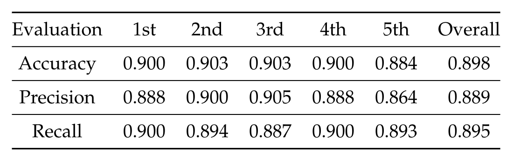

# Implement Iceberg Classifier in Satallite Image using CNN
## Abstract
The purpose of this project is to solve the iceberg classifier challenge and reduce the threat of icebergs to ships in the northern Atlantic Ocean. Expanded the data set using flipping images and tried to use neural network to train the classification model. This neural network includes four convolutional layers, four pooling layers, and two fully connected layers. Tried the influence of different parameters on the model classification results. The final accuracy of this model is 0.898. This result is acceptable because satellite images have low pixels, and ships and icebergs have high similarities.

 
## Background
In the North Atlantic, the threat of ship transportation and operations is not only bad weather, but also icebergs drifting on the sea. Statoil, a international energy company, is a frequent visitor to this sea area, in order to avoid such accidents. It is working closely with C-Core, a company that uses satellite data for data analysis, and hopes to distinguish between ships and icebergs in satellite image through machine learning or neural networks. They have already put the satellite imaging data set on Kaggle, and hope that the challengers will help them find an optimal model to solve this problem. 
## Dataset
The public data can be downloaded from
`https://www.kaggle.com/c/statoil-iceberg-classifier-challenge/data`
It has a total of 1604 samples have defined labels and can be used as a training set. Each sample has two bands, HH (transmit/receive horizontally) and HV (transmit horizontally and receive vertically). Each band has recorded 75x75 pixel values.

 
## Result
Using k-fold cross-validation can show the versatility of the model. A total of five training sessions were conducted in this project, and their results were combined at the end. The overall accuracy is 0.898. The accuracy is 0.889. The recall is 0.895 .

 
